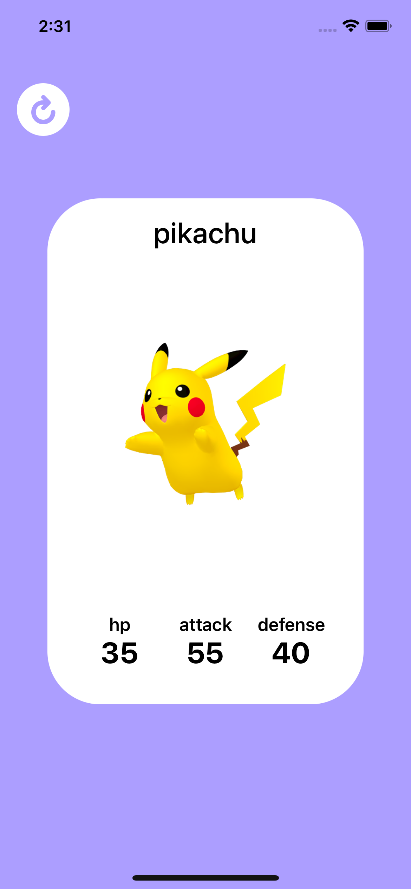

# Pokecards

It is a mobile application in which you can see different pokemon cards. You can simply tap to switch to the next pokemon. I used SwiftUI animations and AnimatableModifier protocol for transitions between cards. So that, they are being animated nicely. Also, the MVVM architecture was used for application.

Used [pokeapi](https://pokeapi.co/api/v2/pokemon/) for data.

The api consists of sets of 20 pokemons and the app is fetching the next set of pokemons when 15. pokemon is on the screen for better UX. By this way, users don't see the loading screen again and again. However, if user's internet is slow, users necessarily see loading screen until new data are fetched. For further details you can look at the comment lines in the code.

## Screenshot

## Demo

